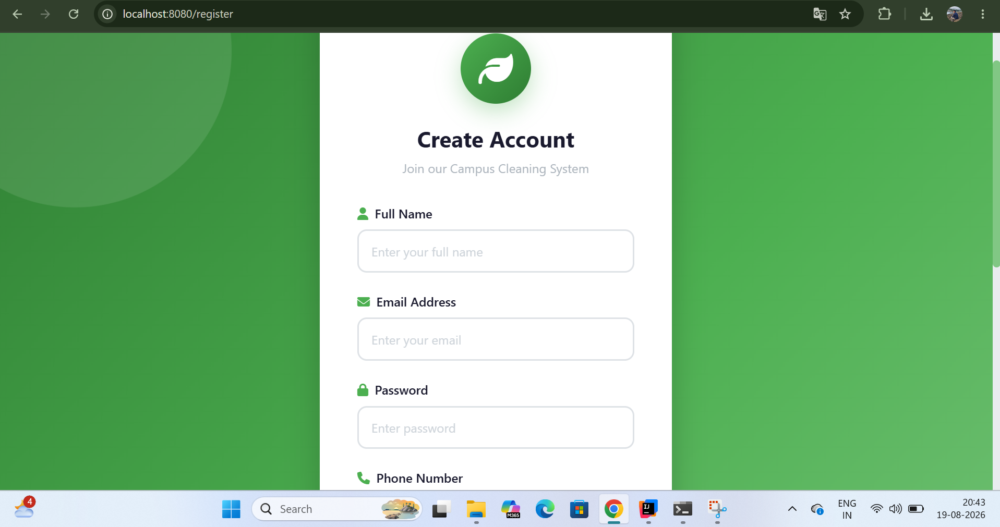
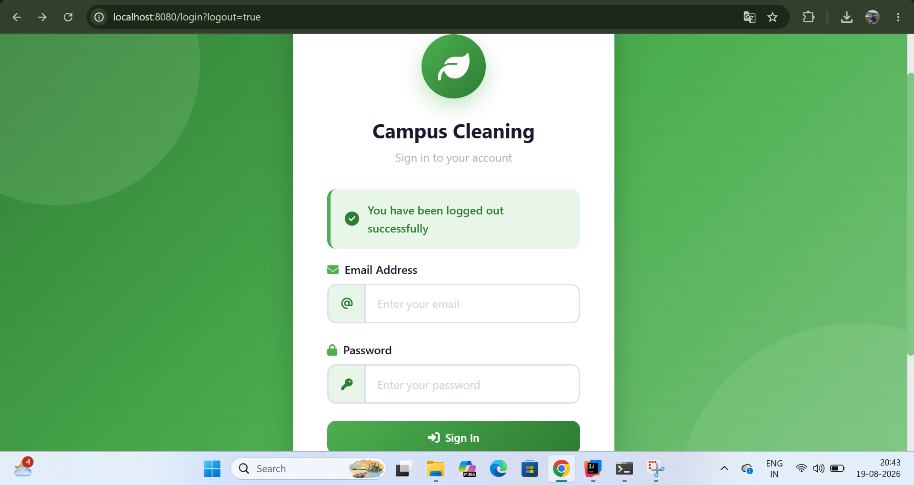
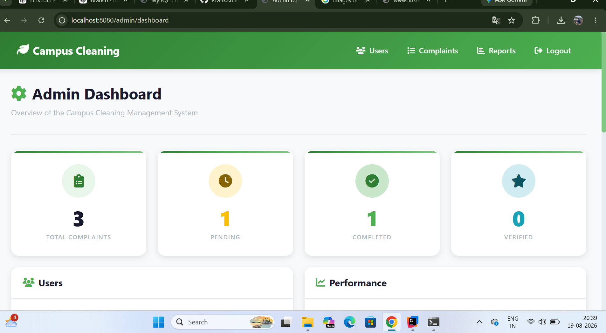
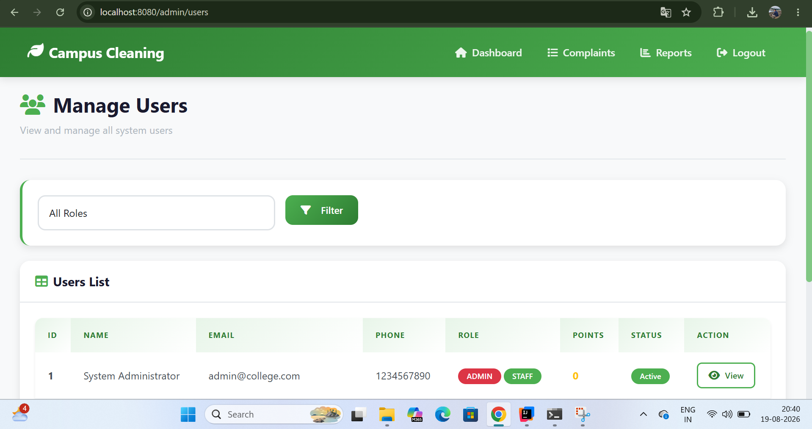
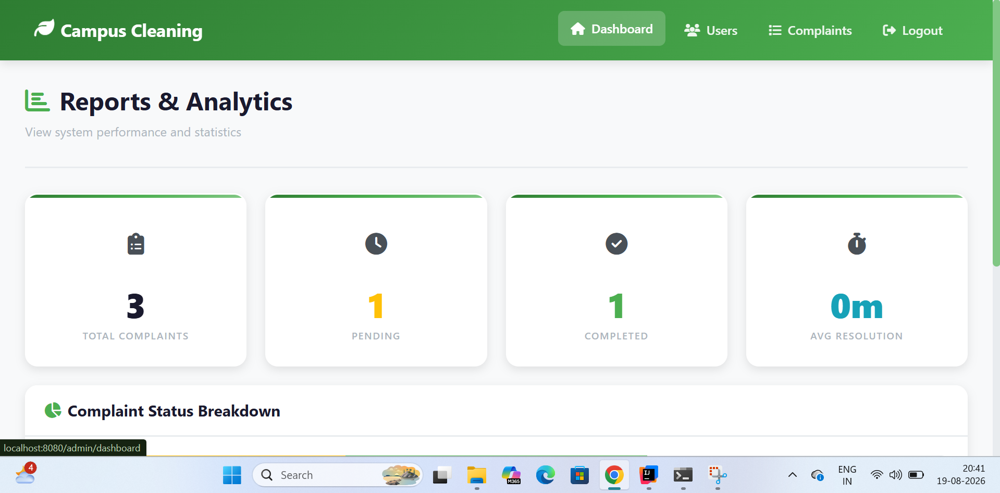
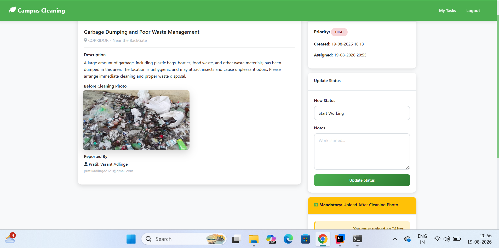
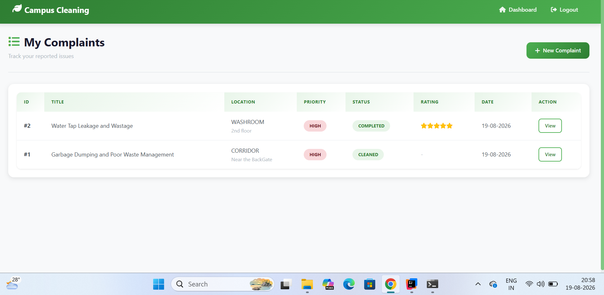
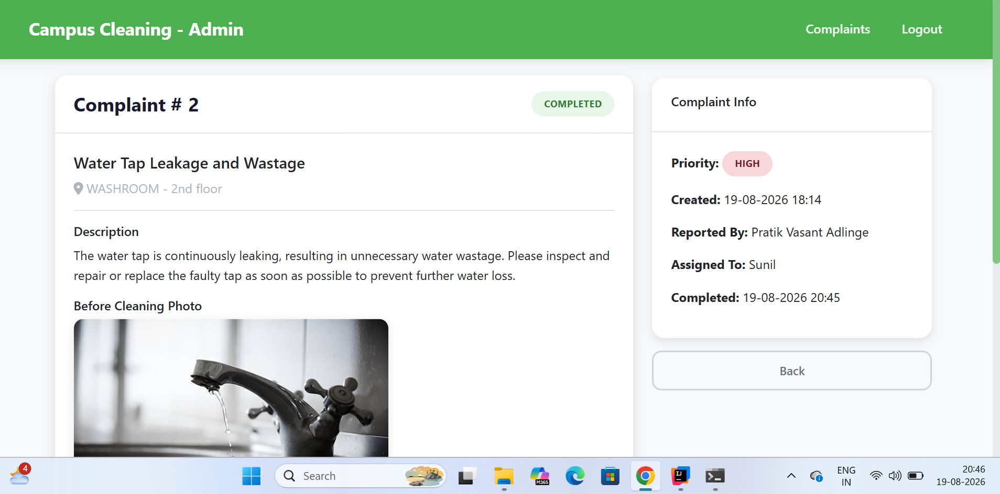
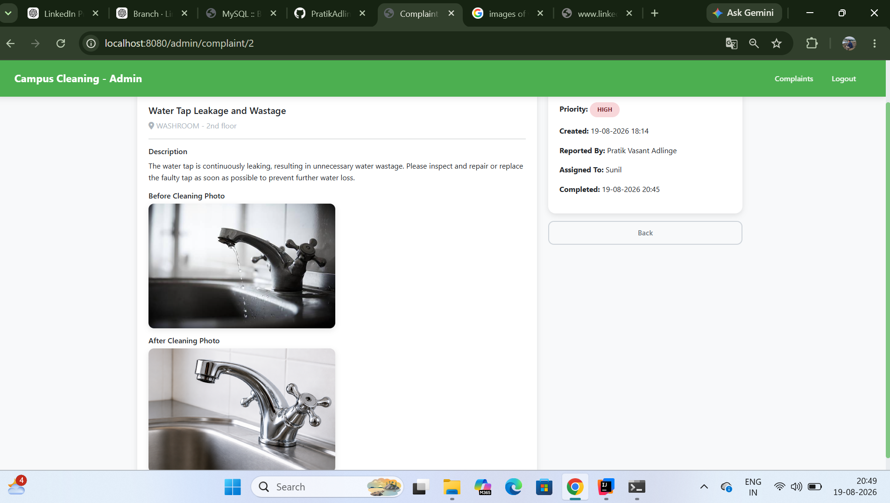

# Campus Cleaning Portal 🧹

A web-based campus cleaning management system built with Spring Boot that helps students report cleanliness-related complaints and enables staff and administrators to manage, track, and resolve those complaints.

## 📌 Project Overview

The Campus Cleaning Portal is designed to improve cleanliness management within a college campus.

Students can submit complaints about cleanliness issues by providing relevant details and location information. Staff members can view and manage complaints, while administrators can monitor users, complaints, reports, and overall system activity.

The system provides role-based functionality for:

- 👨‍🎓 Students
- 🧹 Cleaning Staff
- 👨‍💼 Administrators

## 🚀 Key Features

### 👨‍🎓 Student Features

- Student registration and login
- Submit cleanliness complaints
- Select complaint location
- Set complaint priority
- View submitted complaints
- View complaint details
- Track complaint status
- Receive notifications
- View complaint history

### 🧹 Staff Features

- Staff login
- Staff dashboard
- View assigned complaints
- View complaint details
- Update complaint status
- Manage cleaning-related tasks
- Track complaints requiring attention

### 👨‍💼 Admin Features

- Admin dashboard
- Manage users
- Manage complaints
- View complaint details
- Monitor complaint status
- View reports and analytics
- Manage system data
- System reset functionality

### 🔐 Security Features

- User authentication
- Role-based access control
- Authorization for protected pages
- Custom user details service
- Access-denied handling
- Separate functionality for Student, Staff, and Admin roles

## 🛠️ Technologies Used

### Backend

- Java
- Spring Boot
- Spring Security
- Spring Data JPA
- Hibernate

### Frontend

- HTML5
- CSS3
- Thymeleaf

### Database

- MySQL
- SQL

### Build Tool

- Maven

### Development Tools

- IntelliJ IDEA
- Git
- GitHub

## 🏗️ Application Architecture

The application follows a layered architecture:

**1. User Interface**  
Students, Staff, and Administrators interact with the application through the web interface.

⬇️

**2. Controller Layer**  
Handles HTTP requests and controls application flow.

Examples:
- `AdminController`
- `AuthController`
- `ComplaintController`
- `DashboardController`

⬇️

**3. Service Layer**  
Contains the application's business logic.

Examples:
- `ComplaintService`
- `UserService`
- `NotificationService`
- `FileService`

⬇️

**4. Repository Layer**  
Handles database operations using Spring Data JPA.

Examples:
- `ComplaintRepository`
- `NotificationRepository`
- `RoleRepository`
- `UserRepository`

⬇️

**5. Database Layer**  
MySQL stores users, complaints, notifications, roles, and other application data.

## 📂 Project Structure

```text
CampusCleaning/
├── images/
│   ├── 01-registration.png
│   ├── 02-login.png
│   ├── 03-admin-dashboard.png
│   ├── 04-manage-users.png
│   ├── 05-reports-analytics.png
│   ├── 06-staff-complaint.png
│   ├── 07-my-complaints.png
│   ├── 08-complaint-details.png
│   └── 09-before-after-cleaning.png
├── src/
│   └── main/
│       ├── java/
│       │   └── com/college/cleanliness/
│       │       ├── config/
│       │       ├── controller/
│       │       ├── entity/
│       │       ├── repository/
│       │       ├── security/
│       │       └── service/
│       └── resources/
│           ├── sql/
│           ├── static/
│           └── templates/
│               ├── admin/
│               ├── auth/
│               ├── staff/
│               └── student/
├── uploads/
├── .gitignore
├── pom.xml
└── README.md
```

## 🗄️ Database

The project uses **MySQL** for storing application data.

The database SQL script is available at:

`src/main/resources/sql/database.sql`

The application uses **Spring Data JPA** and **Hibernate** for database interaction.

## 📸 Screenshots

### 1. Student Registration



### 2. Login



### 3. Admin Dashboard



### 4. Manage Users



### 5. Reports & Analytics



### 6. Staff Complaint Management



### 7. Student Complaints



### 8. Complaint Details



### 9. Before & After Cleaning



## ⚙️ How to Run the Project

### Prerequisites

Install the following:

- Java JDK
- Maven
- MySQL
- IntelliJ IDEA

### 1. Clone the Repository

```bash
git clone https://github.com/PratikAdlinge/campus-cleaning-portal.git
```

### 2. Open the Project

Open the cloned project in IntelliJ IDEA.

### 3. Create the Database

Create the required MySQL database.

The project includes the SQL script:

`src/main/resources/sql/database.sql`

Use this script to create the required database structure.

### 4. Configure Database Connection

Create your local `application.properties` file inside:

`src/main/resources/`

Configure your own MySQL credentials:

```properties
spring.datasource.url=jdbc:mysql://localhost:3306/cleanliness_db
spring.datasource.username=YOUR_USERNAME
spring.datasource.password=YOUR_PASSWORD
```

> **Note:** `application.properties` is excluded from GitHub to prevent exposing local database credentials.

### 5. Build the Project

```bash
mvn clean install
```

### 6. Run the Application

Run the main Spring Boot class:

`CleanlinessManagementApplication.java`

from IntelliJ IDEA.

### 7. Access the Application

After the application starts successfully, open the application in your web browser using the configured server port.

## 🔑 Main Application Modules

**Authentication**
- Registration
- Login
- Forgot Password
- Reset Password
- Role-Based Access

**Student**
- Dashboard
- Submit Complaint
- My Complaints
- Complaint Details
- Notifications

**Staff**
- Dashboard
- Complaints
- Complaint Details
- Complaint Management

**Admin**
- Dashboard
- User Management
- Complaint Management
- Reports & Analytics
- System Management

## 📋 Main Components

### Controllers

- `AdminController`
- `AuthController`
- `ComplaintController`
- `DashboardController`

### Services

- `ComplaintService`
- `FileService`
- `NotificationService`
- `SystemResetService`
- `UserService`

### Entities

- `User`
- `Complaint`
- `ComplaintLocation`
- `Notification`
- `Role`
- `Priority`
- `ComplaintStatus`

### Repositories

- `ComplaintRepository`
- `NotificationRepository`
- `RoleRepository`
- `UserRepository`

## 🎯 Learning Objectives

This project helped me practice and understand:

- Java backend development
- Spring Boot application development
- Spring Security
- Spring Data JPA
- Hibernate
- MVC architecture
- Layered application architecture
- MySQL database integration
- Authentication and authorization
- Role-based access control
- CRUD operations
- File upload handling
- Thymeleaf
- HTML and CSS
- Git and GitHub

## 🔮 Future Improvements

- REST API development
- React-based frontend
- Email notifications
- Real-time notifications
- Advanced analytics dashboard
- Cloud deployment
- Docker containerization
- AWS deployment
- Automated unit and integration testing
- Mobile application

## 👨‍💻 Author

**Pratik Adlinge**

MCA Student | Java Backend Developer

### GitHub

https://github.com/PratikAdlinge

### LinkedIn

https://www.linkedin.com/in/pratikadlinge/

## ⭐ Project

If you find this project useful or interesting, feel free to explore the repository.
